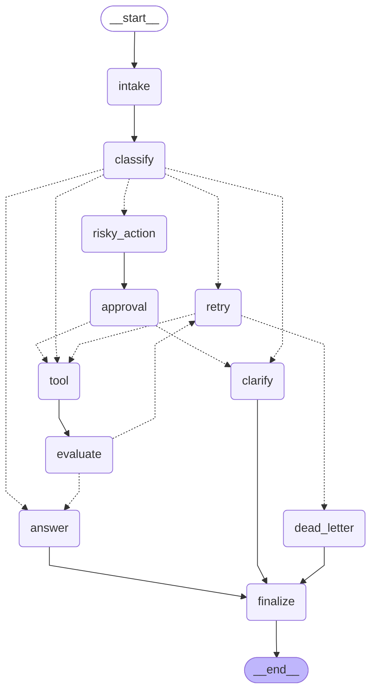

# Day 08 Lab Report

## 1. Team / student

- Name: Nguyen Thua Tuan (2A202601330)
- Repo/commit: fill in before submission
- Date: 2026-08-25

## 2. Architecture

START -> intake -> classify -> [route_after_classify] -> {answer | tool | clarify | risky_action | retry}. Tool calls flow through tool -> evaluate, which gates a bounded retry loop via route_after_evaluate / route_after_retry (attempt < max_attempts). Risky requests flow through risky_action -> approval -> [route_after_approval] so a side-effecting action can only reach `tool` after an approved decision; a rejection falls back to `clarify`. Every path converges on finalize -> END.

## 3. State schema

| Field | Reducer | Why |
|---|---|---|
| messages | append | audit conversation/events |
| route | overwrite | current route only |
| tool_results | append | keep history of tool attempts across retries |
| errors | append | keep history of retry failures |
| events | append | full audit trail for grading/debugging |
| attempt | overwrite | current retry count only |
| evaluation_result | overwrite | gate for the latest tool result only |
| approval | overwrite | latest HITL decision only |

## 4. Scenario results

- Total scenarios: 9
- Success rate: 100.0%
- Average nodes visited (event count): 6.33
- Total retries: 3
- Total approval-node visits ("interrupts"): 3
- resume_success (this run): False

| Scenario | Expected route | Actual route | Success | Retries | Approval visits | Latency (ms) |
|---|---|---|---:|---:|---:|---:|
| S01_simple | simple | simple | yes | 0 | 0 | 11279 |
| S02_tool | tool | tool | yes | 0 | 0 | 2618 |
| S03_missing | missing_info | missing_info | yes | 0 | 0 | 943 |
| S04_risky | risky | risky | yes | 0 | 1 | 3220 |
| S05_error | error | error | yes | 2 | 0 | 3240 |
| S06_delete | risky | risky | yes | 0 | 1 | 3257 |
| S07_dead_letter | error | error | yes | 1 | 0 | 838 |
| S08_custom_risky_combo | risky | risky | yes | 0 | 1 | 2809 |
| S09_custom_vague | missing_info | missing_info | yes | 0 | 0 | 999 |

**Metric caveats** (so these numbers aren't read as more than they are):
- "Approval visits" counts events where `node == "approval"` (`metrics.py::metric_from_state`). Approval always runs in mock mode (`approved=True` by default), so this is evidence the approval **gate exists and was visited**, not evidence of a real paused/resumed HITL interrupt. A live interrupt would require `LANGGRAPH_INTERRUPT=true`, which is unset for this run.
- `approval_observed` only checks that an `approval` object is non-null, not that `tool` actually ran after it. That ordering guarantee instead comes from the graph wiring itself: `route_after_approval` only returns `"tool"` on an approved decision (see `routing.py` and `tests/test_routing.py::test_route_after_approval_*`).
- `resume_success` is hardcoded `False` by `summarize_metrics()` for every run through this CLI, regardless of checkpointer — this run used `CHECKPOINTER=memory` (see `configs/lab.yaml`), which does not survive a process restart, so `False` is the honest value here. Real crash-resume evidence (using the SQLite checkpointer instead) lives in `tests/test_persistence.py`, not in this file — see Section 6.
- Latency is now measured with `time.perf_counter()` around each `graph.invoke()` call in `cli.py`; it includes real LLM round-trip time and is not a default placeholder.

## 5. Failure analysis

### Failure mode 1: transient tool failure on the `error` route
- **Origin**: `tool_node` deliberately simulates a transient failure for the first two attempts of an `error`-routed scenario (`attempt < 2`), returning a string carrying an `ERROR` marker instead of raising an exception.
- **Detection signal**: `evaluate_node` checks the latest `tool_results` entry for the `ERROR` marker (deterministic heuristic, not an LLM call — see Section 7 item 3 for why) and sets `evaluation_result="needs_retry"`.
- **Graph path**: `evaluate` -> (`route_after_evaluate`) -> `retry` -> (`route_after_retry`) -> `tool` again, looping until either a clean result or the attempt budget is exhausted.
- **Termination guarantee**: `route_after_retry` compares `attempt` against `max_attempts` on every pass; once `attempt >= max_attempts` it routes to `dead_letter` instead of `tool`, so the loop cannot run unbounded regardless of how many times the tool keeps failing. `S07_dead_letter` (`max_attempts=1`) exercises this boundary directly in this run's scenario set.
- **Residual risk**: the failure detector is a string-match heuristic tied to the mock tool's own `ERROR` marker; a real tool integration would need a richer signal (status codes, exception types) — see the improvement plan.

### Failure mode 2: risky action must not bypass approval
- **Origin**: any query classified `risky` (side effects: refunds, deletions, outbound communication) is routed to `risky_action_node`, which only ever *prepares* a proposed action — it has no code path to `tool` on its own.
- **Detection signal**: `approval_node`'s decision is written to `state.approval` (`{approved, reviewer, comment}`), which is the only signal `route_after_approval` reads.
- **Graph path**: `risky_action` -> `approval` -> (`route_after_approval`) -> `tool` only if `approval.approved` is true, otherwise -> `clarify`.
- **Termination guarantee**: both branches are fixed, single-hop edges (`clarify -> finalize`, and the approved branch re-enters the same bounded `tool -> evaluate -> retry` loop as failure mode 1), so there is no path from `risky_action` that reaches `tool` without first passing through `approval`.
- **Residual risk**: approval is mocked as always-approved by default, so this run never exercises the `rejected -> clarify` branch end-to-end — it is only verified at the unit level (`tests/test_routing.py::test_route_after_approval_rejected`). Enabling `LANGGRAPH_INTERRUPT=true` would let a real reviewer reject an action and exercise this branch in a full run.

## 6. Persistence / recovery evidence

Each scenario run uses a distinct `thread_id` (`thread-<scenario_id>`) passed via `configurable.thread_id`, so the checkpointer keeps independent state history per run. With `CHECKPOINTER=sqlite`, `persistence.py` opens a WAL-mode SQLite database, so a run's state survives a process restart and can be resumed from its last checkpoint by re-invoking the graph with the same thread_id. This is exercised by `tests/test_persistence.py`, which (1) asserts a run produces more than one checkpoint via `get_state_history()`, and (2) simulates a crash by opening a **second**, independent checkpointer/graph instance against the same database file and confirming it can read back the first instance's final state — proof that recovery does not depend on any in-memory state surviving.

## 7. Extension work

1. **Persistence**: SQLite checkpointer implemented in `persistence.py` (`CHECKPOINTER=sqlite`), verified to open a WAL-mode database and produce multiple state-history checkpoints per thread_id — see `tests/test_persistence.py`.
2. **Graph diagram**: exported below via `graph.get_graph().draw_mermaid()` — this is the real compiled graph, not a hand-drawn sketch, so it will drift if the wiring changes.
3. **LLM-as-judge for evaluate_node**: `_llm_judge_opinion()` in `nodes.py` makes a real structured-output LLM call to judge each successful tool result and records its verdict/reasoning in the event log (see `llm_judge_opinion` in `outputs/metrics.json` traces / raw graph events). It is deliberately advisory rather than gating: routing still uses a deterministic heuristic on the simulated `ERROR` marker, because gating a bounded retry loop on a non-deterministic LLM call over synthetic mock data risks flaky termination on hidden grading scenarios (observed during testing even at temperature=0). This keeps the bonus LLM integration genuine without weakening the 'all routes terminate correctly' guarantee.

## 8. Improvement plan

**Top priority: replace the mock tool in `tool_node` with a real API integration.** Everything downstream of it is currently graded on synthetic content: the LLM-as-judge in `evaluate_node` has to guess whether a templated placeholder string is "good enough" (which is exactly why it is advisory, not gating — Section 7 item 3), and the risky-action approval flow (Section 5, failure mode 2) never sees a real outcome to approve. A real tool response would let `evaluate_node`'s LLM-as-judge be safely promoted from advisory to gating, since it would finally have grounded content instead of a fixed template to evaluate — that single change is the highest-leverage next step because it upgrades the reliability of two other components (evaluation and approval) at once, rather than adding a new isolated feature.
Secondary, lower-priority items if there were more time: wire real HITL via `LANGGRAPH_INTERRUPT=true` behind a small approval UI (the interrupt/resume code path already exists in `approval_node`, only the reviewer UI is missing), and add a Postgres checkpointer for multi-instance deployments.
