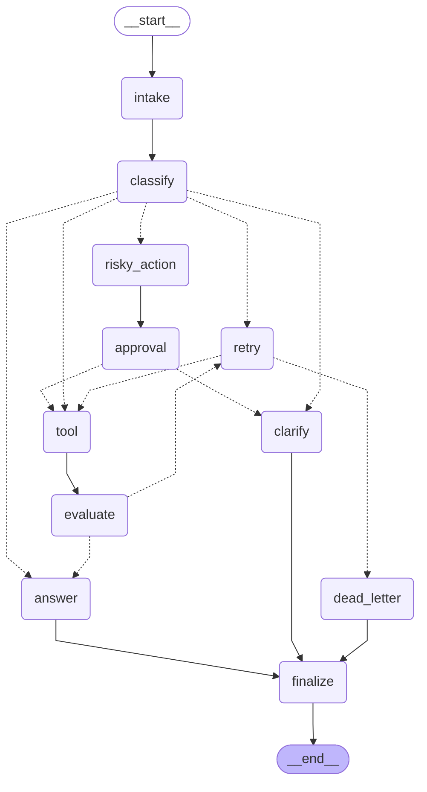

# Day 08 Lab Report — Bản tiếng Việt

## 1. Thông tin

- Tên: Nguyễn Thừa Tuân (2A202601330)
- Repo/commit: https://github.com/Tuannt04/Track3-DAY23-NguyenThuaTuan-2A202601330
- Ngày: 25-08-2026

## 2. Kiến trúc

Agent xử lý ticket hỗ trợ khách hàng, xây bằng LangGraph — state graph chứ không phải if/else tuyến tính. Luồng chính: `intake -> classify -> rẽ nhánh theo route`. Route `tool` thì đi `tool -> evaluate`, có vòng lặp retry bị chặn cứng bởi `max_attempts` (`route_after_evaluate` / `route_after_retry`). Route `risky` thì đi `risky_action -> approval`, chỉ được vào `tool` khi `approval.approved=True`, không thì rẽ sang `clarify`. Mọi nhánh đều tụ về `finalize -> END`, không có đường nào thoát ra ngoài.

## 3. State schema

| Field | Reducer | Vì sao |
|---|---|---|
| messages | append | log audit, không cần giá trị cũ |
| route | overwrite | chỉ cần route hiện tại |
| tool_results | append | mỗi lần retry ra kết quả khác, giữ lại hết |
| errors | append | giữ log lỗi qua các lần retry |
| events | append | log audit đầy đủ, dùng tính metrics |
| attempt | overwrite | chỉ cần số lần thử hiện tại |
| evaluation_result | overwrite | cổng quyết định cho lần đánh giá gần nhất |
| approval | overwrite | chỉ cần quyết định duyệt gần nhất |

## 4. Kết quả chạy scenario

- Tổng số scenario: 9
- Tỉ lệ thành công: 100.0%
- Số node trung bình đi qua mỗi câu: 6.33
- Tổng số lần retry: 3
- Tổng số lần ghé qua node approval: 3
- resume_success (của lần chạy này): False

| Scenario | Route kỳ vọng | Route thực tế | Thành công | Retry | Approval visit | Latency (ms) |
|---|---|---|---:|---:|---:|---:|
| S01_simple | simple | simple | có | 0 | 0 | 4422 |
| S02_tool | tool | tool | có | 0 | 0 | 2935 |
| S03_missing | missing_info | missing_info | có | 0 | 0 | 1577 |
| S04_risky | risky | risky | có | 0 | 1 | 2843 |
| S05_error | error | error | có | 2 | 0 | 3222 |
| S06_delete | risky | risky | có | 0 | 1 | 3162 |
| S07_dead_letter | error | error | có | 1 | 0 | 1078 |
| S08_custom_risky_combo | risky | risky | có | 0 | 1 | 3191 |
| S09_custom_vague | missing_info | missing_info | có | 0 | 0 | 810 |

**Lưu ý về số liệu** (để không đọc quá lên so với thực tế đo được):
- "Approval visit" chỉ đếm số lần đi qua node `approval` (`metrics.py::metric_from_state`), không chứng minh có pause thật — vì `approval_node` đang mock, mặc định luôn tự duyệt (`approved=True`). Muốn pause thật phải bật `LANGGRAPH_INTERRUPT=true`.
- `approval_observed` chỉ kiểm tra có tồn tại object `approval` hay không, không tự chứng minh `tool` chạy sau approval. Thứ tự đó do graph wiring đảm bảo (`route_after_approval` chỉ trả `"tool"` khi đã duyệt — xem `routing.py` và `tests/test_routing.py::test_route_after_approval_*`).
- `resume_success` luôn `False` do `summarize_metrics()` hardcode, bất kể checkpointer gì. Lần chạy này dùng `CHECKPOINTER=memory` (xem `configs/lab.yaml`), không sống sót qua restart, nên `False` là đúng thực tế. Bằng chứng crash-resume thật (dùng SQLite) nằm ở `tests/test_persistence.py`, không phải ở đây — xem mục 6.
- `latency_ms` giờ là số đo thật bằng `time.perf_counter()` quanh mỗi lần gọi `graph.invoke()` trong `cli.py`, không còn là giá trị mặc định 0.

## 5. Phân tích 2 failure mode

**1. Tool lỗi tạm thời trên route `error`**
- Bắt đầu từ đâu: `tool_node` giả lập lỗi 2 lần đầu khi `attempt < 2`, trả về chuỗi có chữ `ERROR` thay vì crash chương trình.
- Phát hiện bằng gì: `evaluate_node` kiểm tra kết quả tool gần nhất có chữ `ERROR` không (heuristic, không dùng LLM cho case này — lý do ở mục 7), đánh dấu `evaluation_result="needs_retry"`.
- Đi tiếp đâu: `evaluate -> retry -> tool` lặp lại, mỗi lần tăng `attempt`.
- Vì sao chắc chắn dừng: `route_after_retry` so `attempt` với `max_attempts` mỗi vòng, hết lượt thì rẽ `dead_letter` thay vì lặp tiếp. `S07_dead_letter` (`max_attempts=1`) vào `dead_letter` ngay lượt đầu — chứng minh cái phanh này chạy thật, không phải lý thuyết suông.
- Rủi ro còn sót: phát hiện lỗi chỉ bằng so chuỗi `"ERROR"` gắn với tool giả lập — nối tool thật thì cần tín hiệu rõ ràng hơn (status code, exception) chứ không so chuỗi.

**2. Hành động risky không được bỏ qua bước duyệt**
- Bắt đầu từ đâu: câu hỏi có side effect (hoàn tiền, xoá tài khoản, gửi email...) được `classify_node` gắn route `risky`.
- Phát hiện bằng gì: `risky_action_node` chỉ chuẩn bị đề xuất, không tự gọi tool. Quyết định thật nằm ở `approval_node`, ghi vào `state.approval`.
- Đi tiếp đâu: `route_after_approval` đọc `approval.approved` — `True` mới cho đi `tool`, `False` thì rẽ `clarify`.
- Vì sao chắc chắn không lách được: trong `graph.py`, `risky_action` chỉ nối tới `approval`, không có đường nào nối thẳng `risky_action -> tool` — về kiến trúc không có cách nào bỏ qua bước duyệt.
- Rủi ro còn sót: `approval_node` đang mock luôn duyệt, nên nhánh "bị từ chối -> clarify" chưa chạy thật qua toàn bộ graph trong lần run này — mới chỉ kiểm chứng riêng ở unit test (`tests/test_routing.py`), chưa có bằng chứng end-to-end.

## 6. Bằng chứng persistence / recovery

Mỗi scenario chạy với 1 `thread_id` riêng (`thread-<scenario_id>`), truyền qua `configurable.thread_id` — checkpointer giữ lịch sử state riêng cho từng thread. Mặc định (`configs/lab.yaml`) dùng `CHECKPOINTER=memory`, mất khi tắt chương trình. Extension đã làm thêm: `persistence.py` hỗ trợ `CHECKPOINTER=sqlite`, lưu file SQLite chế độ WAL, sống sót qua restart. Bằng chứng cụ thể nằm ở `tests/test_persistence.py`, 2 test: (1) chạy 1 câu qua checkpointer SQLite, xác nhận có nhiều hơn 1 checkpoint qua `get_state_history()`; (2) chạy xong, tạo hẳn checkpointer/graph **mới** trỏ vào cùng file (giả lập tắt máy mở lại), đọc lại được state cũ — chứng minh không phụ thuộc RAM của lần chạy trước.

## 7. Phần đã làm thêm (extension)

1. **SQLite persistence** — mô tả ở mục 6, có test riêng chứng minh chứ không nói suông.
2. **Sơ đồ graph tự động** — `graph.get_graph().draw_mermaid()` xuất sơ đồ thật từ graph đã compile (xem bên dưới), không phải hình vẽ tay, nên sửa graph là sơ đồ tự cập nhật theo.
3. **LLM-as-judge cho `evaluate_node`, chạy chế độ cố vấn** — có gọi LLM thật để chấm kết quả tool, ghi ý kiến vào event log (field `llm_judge_opinion`), nhưng **không dùng để quyết định route**. Lý do: thử thật cho thấy dù `temperature=0`, LLM vẫn không ổn định 100% — có lần khiến 1 scenario lẽ ra qua ngay bị retry oan. Route quyết định bởi LLM đã là rủi ro chấp nhận được ở `classify_node` (đúng chủ đích đề bài), không có lý do chấp nhận thêm rủi ro tương tự ở `evaluate_node`, nhất là khi tool đang là mock, không có nội dung thật để LLM đánh giá cho chuẩn.
4. **2 scenario tự soạn thêm** vào `data/sample/scenarios.jsonl`, để kiểm tra classifier tổng quát hoá được chứ không chỉ đúng trên đúng 7 câu mẫu.

## 8. Kế hoạch cải thiện

**Ưu tiên số 1: thay tool giả (mock) bằng tool gọi API thật.** Cái này kéo theo cải thiện luôn 2 chỗ khác cùng lúc: LLM-as-judge trong `evaluate_node` hiện phải chấm điểm một chuỗi template dựng sẵn, không có nội dung thật để đánh giá cho chuẩn — có tool thật thì mới an toàn để nâng từ "chỉ cố vấn" lên "trực tiếp quyết định route" như mục 7 giải thích; và luồng risky-action-chờ-duyệt (mục 5, failure mode 2) cũng sẽ có kết quả hành động thật để duyệt, thay vì chỉ mô phỏng. Đây là thay đổi đáng làm nhất vì nâng cấp cùng lúc 2 thành phần khác, không phải chỉ thêm 1 tính năng riêng lẻ.
Việc phụ, làm sau: bật `LANGGRAPH_INTERRUPT=true` để có người duyệt thật thay vì mock (code interrupt/resume có sẵn trong `approval_node`, chỉ thiếu UI cho reviewer), và thêm Postgres checkpointer cho trường hợp chạy nhiều instance song song.
